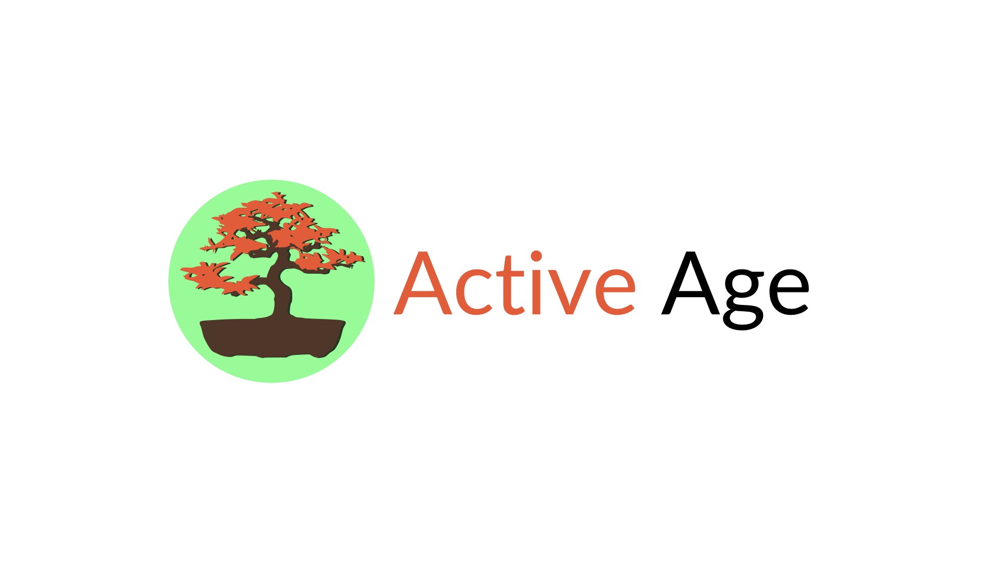

# Active Age

  

A logomarca do projeto "Active Age" apresenta um bonsai, representando longevidade, cuidado, resiliência e a busca por vitalidade, enquanto o círculo evoca comunidade e proteção. A cor laranja na palavra "Active" simboliza energia e atividade.

##  Sobre o Projeto
O **Active Age** é uma plataforma digital multifuncional desenvolvida com o objetivo de **incentivar a saúde, o bem-estar e a conexão social** de pessoas da terceira idade no Brasil. Diante dos desafios de saúde, da falta de reconhecimento social e do isolamento frequentemente enfrentados por essa população, nossa plataforma busca otimizar o acesso a informações e serviços de bem-estar de forma acessível, intuitiva e sustentável.

Este projeto está alinhado com os **Objetivos de Desenvolvimento Sustentável (ODS) da ONU**, em particular o **ODS 3: Saúde e Bem-Estar** e o **ODS 10: Redução das Desigualdades**, promovendo uma vida mais saudável, ativa e conectada para os idosos.

## Tecnologias Utilizadas

*   **Frontend:** HTML, CSS, JavaScript, Bootstrap
*   **Design e Prototipagem:** Figma, Inkscape
*   **Versionamento:** Git, GitHub

## Equipe

*   Clarice Ferreira Rocha Franco
*   Daniel Felipe Ferreira
*   Guilherme dos Santos Silva
*   Mateus de Sousa Pires

##  Agradecimentos

Agradecemos à FATEC Luigi Papaiz - Diadema e aos professores das disciplinas de Engenharia de Software I (Lucio Nunes de Lira), Desenvolvimento Web I (Bruno Zolotareff dos Santos) e Design Digital (Patricia Gallo de França) pela orientação e suporte essenciais durante o desenvolvimento deste Projeto Integrador.
